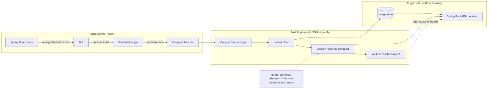

# Build and Deployment Diagram — TRS Episode 01

```mermaid
flowchart LR
    subgraph Build["Build (control node)"]
        A[Spring Boot source] -->|mvn/gradle build + test| B[JAR]
        B -->|podman build| C[Versioned image]
        C -->|podman save| D[Image archive .tar]
    end

    subgraph Ansible["Ansible playbook (SSH key auth)"]
        E[Copy archive to target]
        F[podman load]
        G[Create / reconcile container]
        H[Wait for health endpoint]
        E --> F --> G --> H
    end

    subgraph Target["Target host (rootless Podman)"]
        I[(Image store)]
        J[Spring Boot API container]
    end

    D --> E
    F --> I
    G --> J
    I --> J
    H -.->|GET /actuator/health| J
    K[Re-run playbook: changed=0 / remove container and restore] -.-> G
```

See [architecture.md](architecture.md) for the workflow and security principles.
